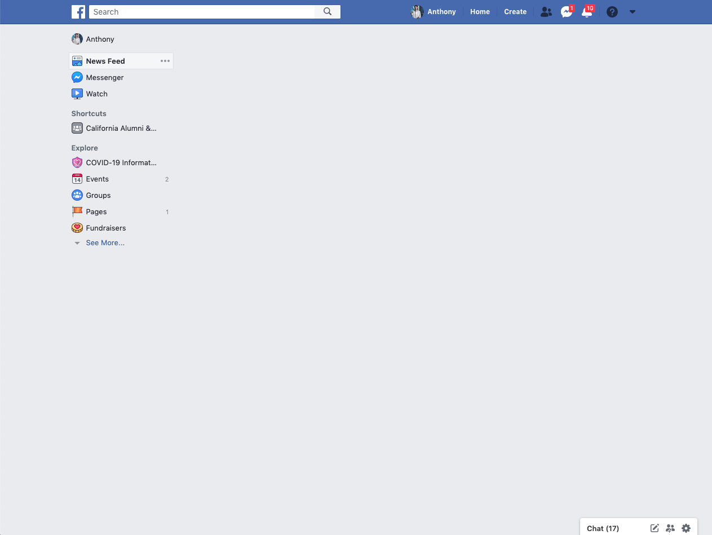
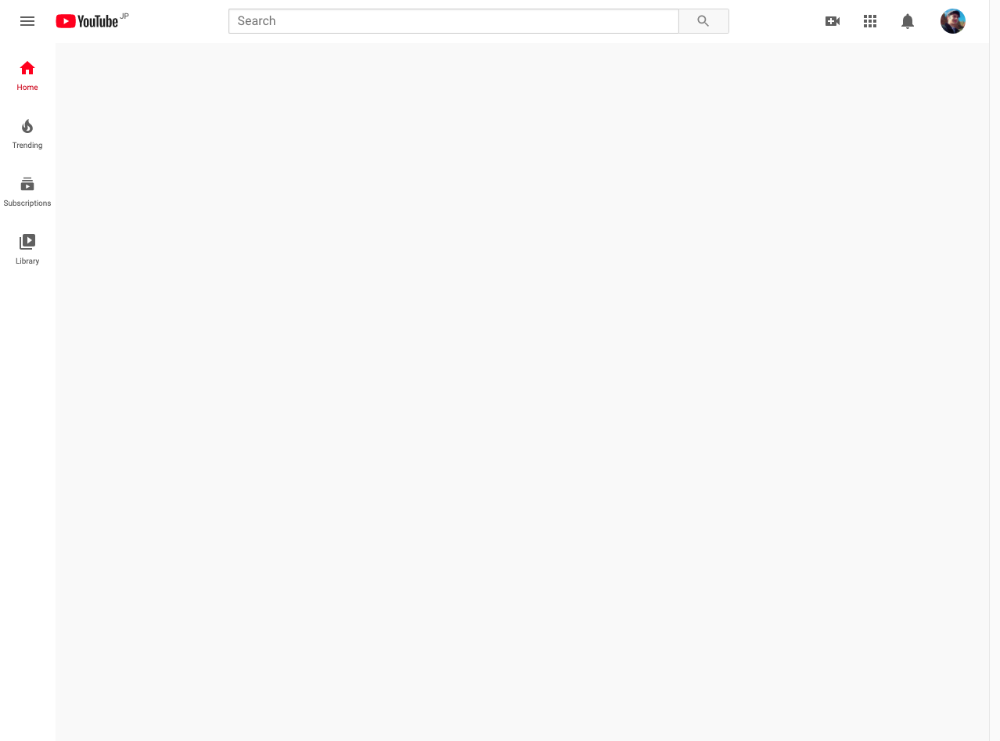

# Productivity Scripts

🐒 JavaScript programs that modify websites like YouTube and Facebook

These are code snippets that you can run in the dev tools console to optimize your experience on certain websites like YouTube's video page and Facebook's homepage.

They can be pasted in tn the console and executed manually or automatically executed with a userscript manager like Tampermonkey or Greasemonkey.

## Contents

- facebookHomepage.js
- linkedinHomepage.js
- linkedInNavbar.js
- youtubeHomepage.js
- youtubeVideoPage.js
- accuweather.js

### facebookHomepage.js

- Remove newsfeed from Facebook homepage

### linkedinHomepage.js

- Remove newsfeed from LinkedIn homepage, including side panels

### youtubeHomepage.js

- Remove Recommended Videos on YT homepage

### youtubeVideoPage.js

- Remove comments and recommended videos from video page

- Provide way to skip the ads on YouTube with the press of a button (customizabe).
  After pasting the code in the console an input element will appear at the top navbar near the search bar.
  Click in the input element and wait until a YouTube advertisement comes on.

  The moment the ad comes up you can push the button (default is set to "0" key) to skip, without having to wait the standard 5 seconds or so.
  If another ad comes on during the same video the one-button-skip will still continue to work.

### accuweather.js

- Remove ads and recommended content in side panel for hourly and daily forecasts on https://www.accuweather.com

- Shrink temperature row stylings for easier reading and getting a quicker glimpse of forecasts
